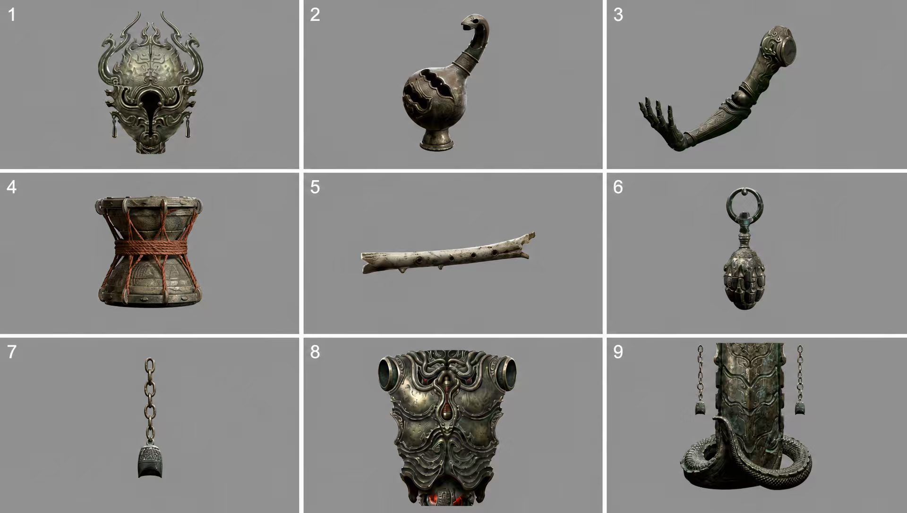
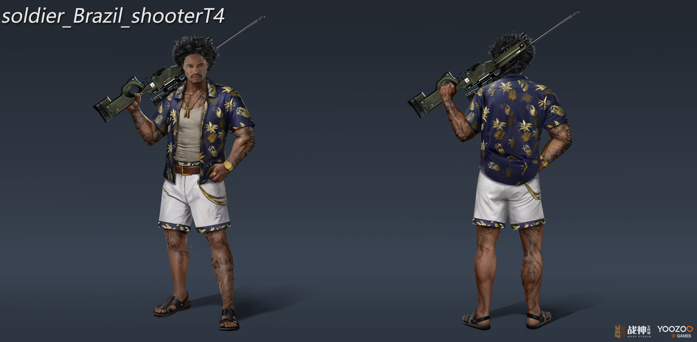

<div align="center">

# Asset Lab · 游戏资产拆解台

**将游戏角色、装备、服装和场景图片识别、分离，并整理成可交付的资产拆解板。**

[](LICENSE)

[快速开始](#快速开始) · [功能](#功能) · [SAM21-高精度分割](#sam21-高精度分割) · [赞赏支持](#赞赏支持)

</div>

## 功能

- GPT‑5.6 Vision 识别角色、装备、服装、饰品和场景对象。
- 返回资产名称、类别、置信度和归一化位置框。
- 本地 GrabCut 透明预览；可选接入 SAM 2.1 获得像素级遮罩。
- 将原图和拆分资产排版为一张拆解板，并导出 PNG。
- gpt-image-2 原图携带式编辑：保真增强、局部补全和创意变体。
- 项目资产库、批处理队列、模型与风格页面。

## 预览

下面是角色原图、部件拆分板和角色设定图示例：

<p align="center">
  
  
</p>

<p align="center">
  
</p>

## 快速开始

### Windows 本地运行

1. 安装 [Python 3.10–3.13](https://www.python.org/downloads/)。
2. 复制配置模板：

```powershell
Copy-Item config.local.json.example config.local.json
```

3. 在 `config.local.json` 填入 OpenAI 兼容接口地址和密钥（该文件已被 `.gitignore` 忽略）。
4. 安装依赖并启动：

```powershell
python -m pip install -r requirements.txt
python server.py
```

5. 打开 <http://127.0.0.1:8080>。

### 使用流程

```text
上传图片 → 开始智能拆解 → 生成透明资产 → 查看拆解板 → 导出拆解板 PNG
```

## SAM2.1 高精度分割

默认配置使用本地 GrabCut，开箱即可运行。需要 SAM2.1 时：

```powershell
python -m pip install -r requirements-sam2.txt
```

下载官方 `sam2.1_hiera_small.pt`，并在 `config.local.json` 填写：

```json
{
  "sam2_checkpoint": "models/sam2.1_hiera_small.pt",
  "sam2_config": "configs/sam2.1/sam2.1_hiera_s.yaml",
  "sam2_device": "cuda"
}
```

配置成功后，点击“生成透明资产”会优先使用 SAM2.1；模型未安装或文件不存在时自动回退 GrabCut。

## 配置字段

| 字段 | 说明 |
| --- | --- |
| `base_url` | OpenAI 兼容服务的 `/v1` 地址 |
| `image_api_key` | 图像编辑/生成密钥 |
| `vision_api_key` | GPT‑5.6 视觉密钥 |
| `image_model` | 默认 `gpt-image-2` |
| `vision_model` | 默认 `gpt-5.6` |

密钥只从本地 `config.local.json` 读取，不要提交到 GitHub。

## 已知限制

- GPT 视觉模型返回的位置框用于初始裁切，复杂遮挡仍需要人工复核。
- GrabCut 适合作为无模型回退；高精度交付建议启用 SAM2.1。
- 单张图片无法恢复隐藏面或真实 3D 拓扑。
- 图像编辑结果会保存在浏览器当前会话，建议及时下载。

## 技术来源

- [SAM 2](https://github.com/facebookresearch/sam2) · Apache-2.0
- [Grounding DINO](https://github.com/IDEA-Research/GroundingDINO) · Apache-2.0
- [OpenCV](https://opencv.org/) · Apache-2.0
- [gpt-image-2 / GPT‑5.6](https://platform.openai.com/docs) · 按服务商条款使用

## 赞赏支持

如果这个项目对你有帮助，欢迎在 GitHub 点一个 Star、提交 Issue 或分享给有需要的人。

也可以自愿扫码支持后续维护：

<p align="center">
  
</p>

赞赏完全自愿，不影响项目功能、问题反馈或后续使用。

## 许可证

本项目采用 [MIT License](LICENSE)。第三方模型和依赖按其各自许可证使用。

## 联系方式

作者邮箱：`1486772654@qq.com`
